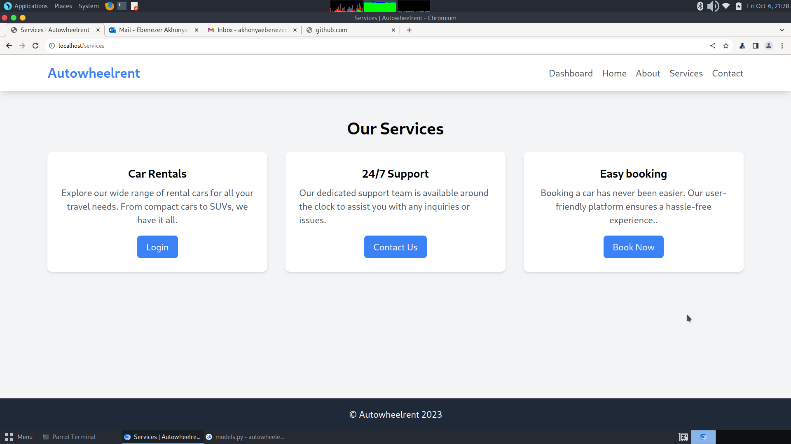
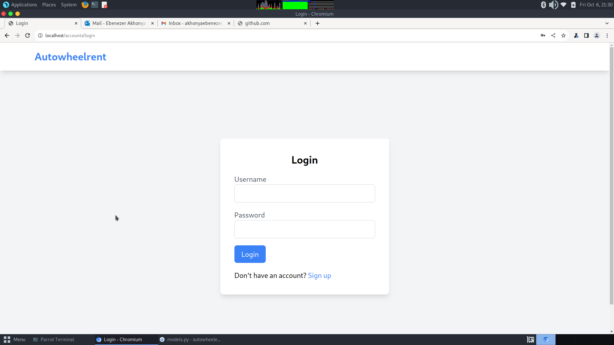
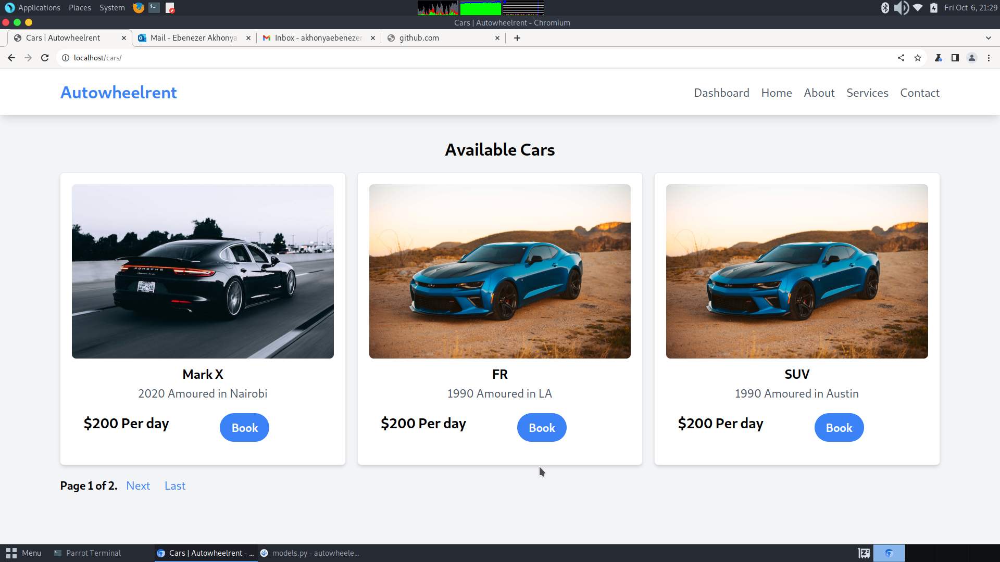

## Autowheelrent 



Autowheelrent is a web application that let's users rent vehicles online. 

## Features
### User authentication 

The web application has user authentication features, for login, signup and password resets

### Car Booking



## Notification
Notification system using django channels and socket io

## Secure Payment 

Secure payment system using stripe and daraja api

## Geolocation
Location mapping using google maps 


## Development Setup
To run this project locally using django's default http server, follow these steps.


1. Clone this repo to your machine. 

```shell
git clone https://github.com/Itsfoss0/autowheelent-mvp
```

2. Change directory to the project you just clone 

```
cd autowheelrent-mvp 
```

3. Install the required packages 

```
pip install -r requirements.txt
```

4. Change the database settings in the `AutoWheeRent/settings.py` file to match the ones you have setup. If you dont have mysql installed, consider using sqlite. Refer to the official [Django docs](https://docs.djangoproject.com/en/4.2/ref/databases/) for this. 


5. Apply the migrations and run the application. 

## Production setup
To setup the application for prod, we will be using gunicorn and nginx to server the static content as well as server as a reverse proxy. Follow these steps to set it up

1. Ensure you have nginx installed. If not follow the official [docs](https://www.nginx.com/resources/wiki/start/topics/tutorials/install/) for steps on how to install it. 

